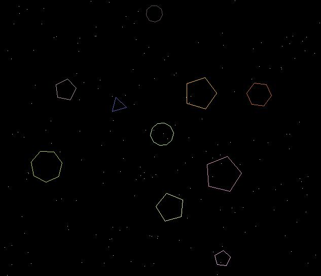



## Bouncing Polygon screensaver

### Description

This screensaver is a result of when i get really bored. there are ten randomly placed polygons, with 3 to 10 sides. they have different radii and spin direction. when they crash together new polygons are formed.
 
### More Info
 

             |
---                |---
**Submitted On**   |2004-02-29 10:38:26
**By**             |[Brian\_A ](https://github.com/Planet-Source-Code/PSCIndex/blob/master/ByAuthor/brian-a.md)
**Level**          |Beginner
**User Rating**    |5.0 (10 globes from 2 users)
**Compatibility**  |VB 5\.0, VB 6\.0
**Category**       |[Graphics](https://github.com/Planet-Source-Code/PSCIndex/blob/master/ByCategory/graphics__1-46.md)
**World**          |[Visual Basic](https://github.com/Planet-Source-Code/PSCIndex/blob/master/ByWorld/visual-basic.md)
**Archive File**   |[Bouncing\_P1714532292004\.zip](https://github.com/Planet-Source-Code/brian-a-bouncing-polygon-screensaver__1-52063/archive/master.zip)

